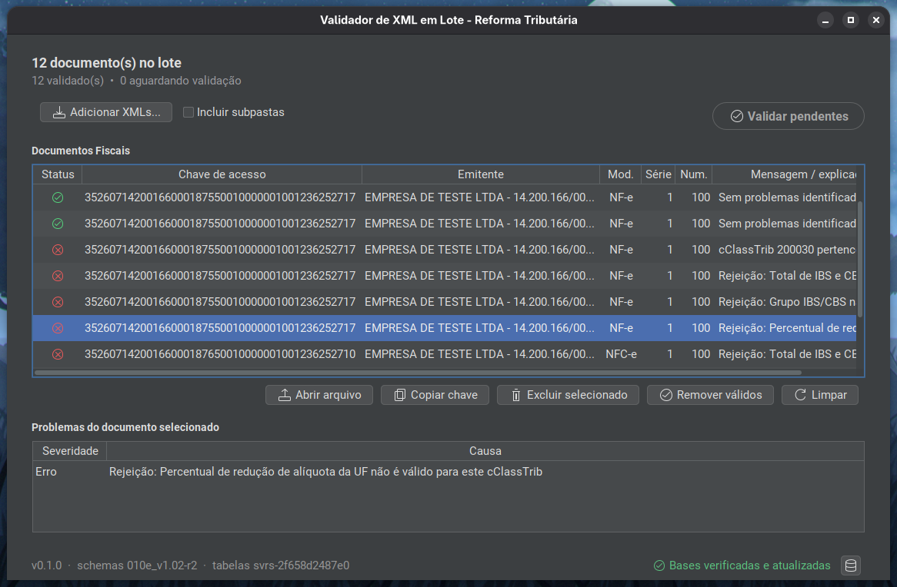

# Validador de XML em Lote — Reforma Tributária

[](https://github.com/vBaggio/validador-lote-rtc/releases/latest)
[](https://github.com/vBaggio/validador-lote-rtc/actions/workflows/ci.yml)
[](#instalação)
[](#visão-técnica)
[](#validação-em-camadas)
[](./LICENSE)

Aplicativo desktop gratuito para revisar, de uma vez, lotes de XMLs de **NF-e (modelo 55)** e
**NFC-e (modelo 65)** relacionados à Reforma Tributária do Consumo (IBS/CBS). Ele ajuda equipes
contábeis e fiscais a localizar inconsistências antes de tratar os documentos um a um.

<br>

<p align="center">
  <a href="#instalação"><strong>📦 Instalação</strong></a>
  &nbsp;&nbsp;•&nbsp;&nbsp;
  <a href="#como-usar"><strong>▶️ Como usar</strong></a>
  &nbsp;&nbsp;•&nbsp;&nbsp;
  <a href="#sugestões-e-problemas"><strong>💬 Sugestões e problemas</strong></a>
</p>

<br>

> [!WARNING]
> **Projeto em estágio inicial de desenvolvimento:** o aplicativo ainda pode cometer erros. Sua
> proposta é oferecer uma forma rápida de fazer a triagem de grandes lotes de notas, com
> processamento local e sem depender da internet. Caso um documento receba resultado negativo,
> confirme-o no
> [Validador NFe oficial da SVRS](https://dfe-portal.svrs.rs.gov.br/NFE/ValidadorNfe), que oferece
> uma conferência mais apurada, realizada individualmente, um arquivo por vez.

<p align="center">
  
</p>

## O que o aplicativo faz

- Reúne uma pasta ou vários XMLs em um único lote de trabalho.
- Valida os documentos em segundo plano e mostra o andamento de cada um.
- Lista todos os problemas encontrados, em vez de parar no primeiro erro.
- Organiza o resultado por documento e ajuda a concentrar a revisão no que exige atenção.
- Verifica automaticamente se existem bases de validação mais recentes e pede confirmação antes
  de aplicá-las.

### Validação em camadas

Cada XML passa por verificações complementares:

1. **Leitura segura do documento** — identifica o arquivo, o modelo e os dados necessários sem
   permitir entidades externas ou conteúdo XML inseguro.
2. **Estrutura oficial (XSD)** — confere campos obrigatórios, formatos, tipos e a organização do XML
   contra os schemas de NF-e/NFC-e usados pelo aplicativo.
3. **Regras conhecidas da NT e tabelas fiscais** — verifica condições implementadas da NT 2025.002
   e relações suportadas de CST e cClassTrib. Quando não há informação suficiente para uma
   conclusão segura, o resultado é marcado como **não avaliado**, nunca como acusação.

Ao final, os achados são apresentados no documento correspondente, com uma explicação e o detalhe
disponível para apoiar a correção.

### O que ele não faz

- Não emite, assina, transmite ou corrige XMLs.
- Não garante que um documento será autorizado pela SEFAZ.
- Não substitui a análise do contador ou responsável fiscal.
- Não executa, nesta versão, a conferência completa de cálculos da Calculadora oficial.

### 🔒 Seus XMLs permanecem no seu computador

Todo o conteúdo fiscal é processado localmente. Não há cadastro, telemetria nem envio de XML,
chave de acesso ou CNPJ. As únicas consultas externas são para verificar novas versões do
aplicativo e das bases de validação; os documentos do lote não participam dessas requisições.

## Instalação

O Windows é a plataforma principal e possui um instalador pronto para uso. Para Linux, a release
oferece um pacote para Ubuntu e outras distribuições baseadas em Debian.

### Windows

[](https://github.com/vBaggio/validador-lote-rtc/releases/latest)

1. Abra a página da [versão mais recente](https://github.com/vBaggio/validador-lote-rtc/releases/latest).
2. Na seção **Assets**, clique no arquivo que termina em `.msi`.
3. Abra o arquivo baixado e siga as etapas do instalador.
4. Inicie **ValidadorLoteRTC** pelo atalho criado na área de trabalho ou pelo menu Iniciar.

O instalador já inclui o Java necessário. Não é preciso instalar componentes adicionais. Para
atualizar uma instalação existente, baixe uma versão mais recente e execute o novo MSI por cima;
as configurações e bases locais são preservadas.

> O instalador ainda não possui assinatura digital e o Windows pode exibir um aviso. Antes de
> continuar, confirme que o arquivo foi baixado da página oficial deste repositório.

### Linux — Ubuntu e Debian

Baixe o arquivo `.deb` na
[página de releases](https://github.com/vBaggio/validador-lote-rtc/releases/latest) e, na pasta do
download, execute:

```bash
sudo apt install ./validadorlotertc_*_amd64.deb
```

### Linux — Fedora

O RPM ainda não é publicado automaticamente. Para gerá-lo a partir do código-fonte, instale o JDK
21 e as ferramentas de empacotamento:

```bash
sudo dnf install java-21-openjdk-devel rpm-build
./gradlew jpackageInstaller
sudo dnf install ./build/jpackage/*.rpm
```

## Como usar

1. Arraste uma pasta ou XMLs para a área central, ou use o botão para adicionar arquivos.
2. Revise os documentos exibidos e remova do lote o que não deseja analisar.
3. Antes de validar, escolha se deseja **considerar a vigência das regras de validação**. A opção
   vem marcada para permitir testar XMLs de amostra emitidos antes da virada: o aplicativo usa
   03/08/2026 para o regime normal e 04/01/2027 para Simples Nacional/MEI, sem alterar a data
   gravada no XML. Desmarque-a para usar estritamente a data de emissão. Quando houver XML do
   Simples emitido antes de 2027, o aplicativo explica esse efeito antes de iniciar.
4. Clique em **Validar pendentes** e acompanhe o progresso. É possível interromper sem perder os
   resultados já concluídos.
5. Selecione um documento para consultar seus problemas na grade inferior.
6. Depois da revisão, use **Remover válidos** para manter na tela apenas o que requer atenção.

Os estados e cores ajudam a navegar pelo lote, mas não substituem a leitura da mensagem e do
detalhe de cada ocorrência.

## Atualizações

### Bases de validação

O aplicativo consulta em segundo plano novas versões dos schemas e da tabela fiscal, sem atrasar a
abertura ou impedir o uso offline. Quando encontra uma base mais recente, informa o usuário e pede
confirmação antes de aplicá-la. Se houver uma validação em andamento, a troca espera sua conclusão.

Versão, origem e estado das bases podem ser consultados pelo rodapé da janela, em **Fontes
externas**. Uma falha de rede preserva a última base válida disponível.

### Aplicativo

Quando existe uma nova versão do programa, um aviso oferece acesso à página oficial da release. O
aplicativo não baixa, instala nem reinicia automaticamente; a atualização continua sob controle do
usuário.

Atualizar as bases não substitui a instalação de uma nova versão do aplicativo quando houver
mudanças estruturais ou de algoritmo.

## Visão técnica

- **Java 21**, Swing e FlatLaf para a interface desktop.
- **Gradle** para build e automação.
- **jpackage/jlink** para instaladores com runtime embarcado.
- **JUnit 5, AssertJ e ArchUnit** para testes e fronteiras arquiteturais.
- Processamento XML seguro, sem `DOCTYPE` ou entidades externas.

O fluxo principal percorre leitura segura, parsing, validação XSD, regras complementares,
organização dos achados e apresentação do resultado. As camadas seguem a dependência
`presentation → application → {domain, infrastructure}`.

Os detalhes de arquitetura, decisões e proveniência das bases estão em [`docs/`](./docs/), com
visão geral em [`docs/architecture.md`](./docs/architecture.md).

## Desenvolvimento

Pré-requisito: JDK 21. Não é necessário ter Gradle instalado; use o wrapper incluído:

```bash
./gradlew clean test --console=plain
./gradlew run
```

Para gerar uma imagem da aplicação ou o instalador nativo do sistema atual:

```bash
./gradlew jpackageImage
./gradlew jpackageInstaller
```

Os artefatos são criados em `build/jpackage/`.

## Sugestões e problemas

Encontrou um erro, algo que não ficou claro ou tem uma ideia para melhorar o aplicativo? Abra uma
[nova issue no GitHub](https://github.com/vBaggio/validador-lote-rtc/issues/new). O mesmo canal é
usado para relatos de problemas e sugestões.

Ao reportar um problema, inclua:

- versão do aplicativo e sistema operacional;
- o que você tentou fazer e o que esperava acontecer;
- o que aconteceu de fato e, se possível, os passos para reproduzir;
- captura de tela ou mensagem exibida, quando ajudarem a entender o caso.

Não anexe XMLs reais, chaves de acesso, CNPJ ou outros dados fiscais. Se um arquivo for essencial
para reproduzir o problema, remova os dados sensíveis ou use um exemplo fictício.

Para uma sugestão, explique brevemente a necessidade e como a mudança ajudaria no uso cotidiano.

## Licença

[GPL-3.0](./LICENSE) — livre para usar, estudar, modificar e redistribuir; trabalhos derivados
devem permanecer abertos.

## Contato

- [LinkedIn — Vinícius Baggio](https://www.linkedin.com/in/vbaggio/)
- [vnc.baggio@gmail.com](mailto:vnc.baggio@gmail.com)
